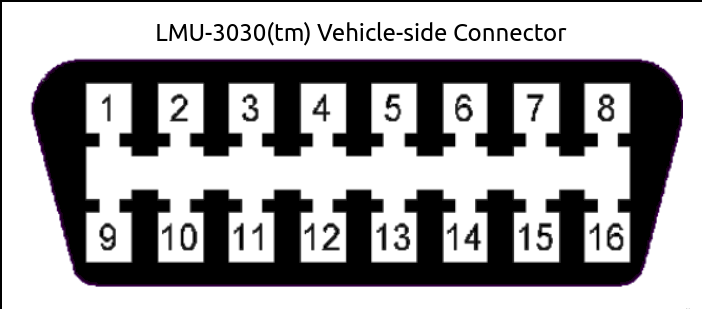
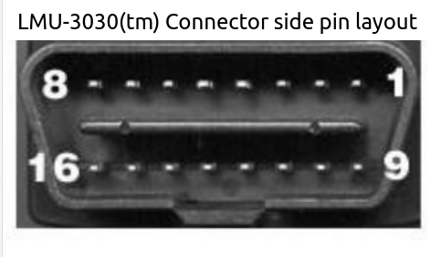
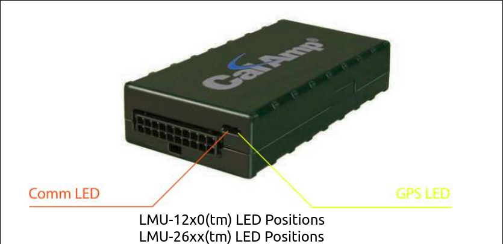
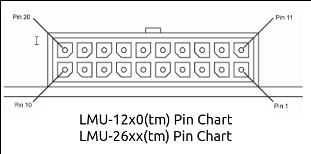

## PEG Commands Information

[Overview](#overview)<br>
[Setup Walkthrough (APN)](#setup-walkthrough-apn)<br>
[Setup Commands Cheatsheet](#setup-commands)<br>
[Verify Setup Cheatsheet](#verify-setup)<br>
[Point to back end server (32 bit)](#point-to-back-end-server-32-bit)<br>
[Miscellaneous Commands](#miscellaneous-commands)<br>
[APN](#apn)<br>
[Current Event Codes](#current-event-codes)<br>
[LMU-30xx Devices](#lmu-30xx-devices)<br>
[LMU-12x0 and LMU-26xx Devices](#lmu-12x0-and-lmu-26xx-devices)<br>
[LMU-12x0 and LMU-26xx Header Pin Chart](#lmu-12x0-and-lmu-26xx-header-pin-chart)

<br>

## Overview

This is a compilation of useful information for walking through and troubleshooting LMU devices 1230, 2630, 3035, and 3040. The sections below include getting setup, verifying your setup, pointing to the correct server, miscellaneous commands and important information regarding the sim cards. Also included is the pin chart and connector layout for each build. Keep in mind there will be two different charts for older models (12x0, 26xx series) and newer models (30xx series ) 

<br>

## Setup Walk-through (APN)

If this is your first time configuring a device, I'd advise going through the section below to setup and verify. If you're familiar with the setup, you can jump down to the [Setup Cheatsheet](#setup-commands).


## For Kore sim card setup

On Kore (https://prismpro.koretelematics.com/)
- On the top bar menu, go to <b>Devices</b> and select <b>Activate Now</b>
- For the activation options, choose the following

| Field | Selection |
|---|---|
| Service Type | KORE USA GSM (Gold) |
| Activation Profile | Custom Activation |
| Cost Center Selection | Red Sky |
| Sim Selection | Device Search |
| Transition To State | Active |

- Find the nano sim card to use. The regular size sims will not fit in the device.
- Enter the sim number you want to activate. You can just use the scanner in the safe if you still have the sim card bar label. Otherwise you will have to enter the entire sim number. There should be a stack indicating which sim to use next as well as Hans has a list of inactive sim cards.
- Under <b>Data Plan Class</b>, choose the option <b>LTE USG 25MB NORAM Pooled Plan (SI)</b>
- For <b>SMS Plan Class</b>, choose the option <b>USG SMS pay per use</b>

After choosing the SMS Plan Class, this will cause several fields that you can make selections on. The only other option you need to change is the <b>APN/IP Related</b> category.

- Change the APN selection to <b>US LTE Dynamic 10569</b>. Leave everything else the same for right now.
- Proceed through confirmation and wait unti you have an email confirmation verifying the sim card is active. Activation for the sim card can take upwards to about 10 minutes. 
- When you get the confirmation meassage saying the sim is active, look for the <b>MSIISDN</b>, also known as the phone number for the sim card. You'll need to know this to communicate with the device.

Once activation is ready, you can proceed to settin up the Calamp listener device.

## Device Setup

To setup the device, locate the circuit board in the office. There should be a DC Power Supply Box connected to the circuit board. 

- Power the DC voltage baox and set it to about 14v. At minimum the voltage needs to be over 13.8v to register as the ignition on the vehicle.

- Activate the Sim card with the correct APN of `10569.mcs`
- Download and install HyperTerminal
- Insert the Sim card into the device.
- Enter in the phone number and which way you want to connect.

Once inside, you can the set up the APN through the terminal commands.

- Set the APN dor index 0 with `AT$APP PARAM 2306,0,APN`. The APN we're using is `10569` 
- Set the APN index 1 with `AT$APP PARAM 2306,1,APN`. Use the same APN number from above.
- Then configure the S-Register so the device doesn't reset with `AT$APP PARAM 1024,25,255,1`
- Restart the device with command `AT$APP PARAM 1024,35,255,1`
- Verify the setup is successful with the command `ATIC`. What should come back is the message <b>Yes</b> for <b>Network Reg.</b>, <b>Data Reg.</b> and <b>Connection</b>

If you want to verify the setup via SMS, you can also send the command `!R0` to the phone number to get a response. You cna also force check in the device through PULS manager `!R3,49,129`. 

<br>

### For LMU-3040 devices

LMU-3040 devices can be interacted via ssh either using a client like PuTTy or on unix platforms. 

- ssh into the 3040 device with <b>host ip</b> being `192.168.255.1` and port `22`.
- login with user <b>calamp</b> and the correct password.

If you're on a Linux system, 

- (Optional) Once you get logged into the device, run the command `atcon` to go into the interactive mode.
- To send AT commands from your Linux terminal, send the commands in the following format.

```console
atcmd_cli atcmd "AT command"
```
Be sure to keep the commands surround in quotation marks. An example would be 

```console
atcmd_cli atcmd "ATIC" 
```
This gives us the general information contained on the network. 

<br>

## Setup Commands Cheatsheet

| Description | Command |
|---|---|
| Set APN Index 1 | AT$APP PARAM 2306,0,APN |
| Set APN Index 2 | ATT $APP PARAM 2306,1,APN|
| Set S-Register default | AT$APP PARAM 1024,35,255,1 |
| Reboot for new settings | AT$APP reboot |

<br>

## Verify Setup Cheatsheet

| Description | Command |
|---|---|
| Current IP address | AT$APP ADDR? |
| Detailed Comm Status | AT$APP COMM STATUS? |
| Verify GPS status | AT$APP GPS? |
| General Network Info | ATIC |
| SMS ping device | !RO |
| SMS Force Check with PULs | !R3,49,129 |

<br>

## Point device to back end server

<b>Note</b>: The script for parsing out the data is able to setup all the inbound addresses. In case you have to set up the end points manually, follow the instructions below. 

The devices we're using are 32-bit. These require different parameters we need to hit on the other side of the server.

Type the following commands in order. 

- Set the inbound IP address with `AT$APP PARAM 768,0,ip-address`.<br> 
- Put the inbound port list with `AT$APP PARAM 769,0,port` (maybe 769,1,port).<br>
- Create the inbound url with `AT$APP PARAM 2319,0,ip-address`.
- Set the second inbound url with `AT$APP PARAM 2319,1,ip-address`.

<b>1)</b> AT$APP PARAM 768,0,<i>ip-address</i><br>
<b>2)</b> AT$APP PARAM 769,0,<i>port</i><br>
<b>3)</b> AT$APP PARAM 2319,0,<i>ip address</i><br>
<b>4)</b> AT$APP PARAM 2319,1,<i>ip address</i><br>

<br>

## Miscellaneous Commands

Below are some general commands you can also send when you have the device in operation. AT Commands will preface with `AT` or `AT$APP`. SMS commands will usually start with `!R`, `!S`, `!V`, or `!APN` for querying the APN.

| Description | Command |
|---|---|
| Query Version Information | ATI0 |
| Query LMU and Modem Identifiers | ATI1 |
| Query Voltage Levels | ATI3 |
| GPS Status Response | ATI4 |
| Query LMU GPS Status | ATIG |
| Vehicle Status Report (only works on OBD II) | ATIV |
| Query LMU Inbound Setting | AT$APP INBOUND? |
| Query Input Status | AT$APP INPUT? |
| Query Analog to Digital Convertor Values | AT$APP ADC? |
| Query device's ESN | AT$APP ESN |
| Force Check in 1 | AT$APP PEG ACTION 49 129 |
| Force Check in 2 | AT$APP PEG SNDID 129 |
| Clear logged messages | AT$APP PEG ACTION 5 0 |
| Reset Device | AT$APP PEG ACTION 70 0|
| Force Report | AT$SPP PEG ACTION 70 0|
| Show data stream, this includes all connected devices via bluetooth, usb, and more. | AT$APP stream |
| Return current values for all accumulators | AT$APP ACC? |
| Device Current IP address | AT$APP ADDR? |
| Current device timers | AT$APP TIMERS? |
| Default All device settings | AT$APP DEFAULT ALL |
| Factory Reset | AT#FACTORY (found, but wrong one) |
| SMS Event Report | AT$APP PEG SNDSMS <i>event code</i>  |
| Shut down GPS and wireless device | AT$APP REBOOT |
| Hard Reset | AT RESET |
| Get Status Info | AT$APP VBUS?, ATIV |
| Query Script Version | ATS121? |
| Query for Config Version | ATS143? |

<br>

## APN 

Our devices are starting to move off Hologram sims and will be using AT&T standard SIM cards. Number to associate with the sim for APN override is below. The APN has already been used in the setup.

| Company | APN |
|---|---|
| AT&T | NXTGENPHONE |
| Hologram | HOLOGRAM |
| KORE | 10569.mcs|


<br>

## Current Event codes

<b>Note</b> Some of these event codes are subject to change, depending on what we may think is needed for accurate information.

| Event Code | Event |
|---|---|
| 0 | Ignition On | 
| 1 | Ignition Off |
| 2 | Time Distance |
| 3 | Over speed limit |
| 4 | OTA Download | 
| 5 | OTA Complete |
| 6 | Idle Receipt |
| 7 | Parking Heartbeat |
| 8 | Calamp Battery Low |
| 9 | Vbattery Low |
| 10 | Reserved |
| 11 | Reserved |
| 12 | Reserved |
| 13 | Reserved |
| 14 | Reserved |
| 15 | Reserved |

<br>

## LMU-30xx Devices

The LMU-30xx (3035, 3040) devices are our newest devices for tracking vehicles. The devices are set for self-installation and contain a better GPS performance indicator versus other devices. 

Below you can see the diagram of how the device should plug into the vehicle. Note that the 3035 and 3040 devices follow the same pattern.

<kbd><br>

From the other side of the device, the pin layout and chart goes as the following LMU-3030 example.

<kbd><br><br></kbd>

| Pin | Signal Name | Description |
|---|---|---|
| 1 | Make/Model Specific | Vendor Option |
| 2 | Bus+ Line | SAE-J1850 PWM and SAE-1850 VPW |
| 3 | Make/Model Specific | Vendor Option |
| 4 | Chassis Ground | Ground |
| 5 | Signal Ground | Ground |
| 6 | Can High | ISO 15765-4 and SAE-J2284 |
| 7 | K line | ISO 9141-2 and ISO 14230-4 |
| 8 | Make/Model Specific | Vendor Option |
| 10 | Bus- Line| SAE-J1850 PWM and SAE-1850 VPW |
| 11 | Make/Model Specific | Vendor Option |
| 14 | Can Low | ISO 15765-4 and SAE-J2284 |
| 15 | L line | ISO 9141-2 and ISO 14230-4 |
| 16 | Battery Power | Power |

<br>

## LMU-12x0 and LMU-26xx Devices

Both LMU-12x0 and LMU-26xx units have similar build and pin chart descriptors. Both units have two LED lights that can indicate the status. This is the <b>Comm Status</b> (1) and the <b>GPS Status</b> (2) indicators. You can see where the indicators will light up below.

<b>Note</b>: The 26xx units are replacing the 12x0 units. We still have some for commerical use, but most of the documentation will move on to the 26xx. 

<kbd><br><br></kbd>

<br>

####  LED #1 Comm LED - Orange Indicators

| Condition | Light |
|---|---|
| Modem off | Off |
| Comm On - Searching | Slow Blinking |
| Network Available | Fast Blinking |
| Registered but no Inbound Acknowledgement | Solid to Fast Blink every second. |
| Registered and Received Inbound Acknowledgement | Solid light |

<br>

#### LED #1 Comm Status - First 10 Seconds

| Condition | State |
|---|---|
| Modem Off | Off |
| Comm On - Searching | 1 Hz Blink (4 seconds) |
| Network Available | 4 Hz Blink (8 times or 2 seconds.) |
| Registered but no Inbound Acknowledgement | N/A |
| Registered and Received Inbound Acknowledgement | Solid (4 seconds) |  

<br>

#### LED #2 GPS - Green and Yellow  Indicators

| Condition | Light |
|---|---|
| GPS Off | Off |
| GPS On | Slow Blinking |
| GPS Time Sync | Fast Blinking |
| GPS Fix | Solid |

<br>

#### LED #2 GPS - Second 10 seconds (Green Color Mode)

| Condition | State |
|---|---|
| GPS Off | Off |
| GPS On | 1 Hz Blink (4 seconds) |
| GPS time sync | 4 Hz Blink (8 times or 2 seconds) |
| GPS fix | Solid (4 seconds) |

<br>

#### VBUS and WiFi - Third 10 seconds (Green color mode only) 

| Condition | State |
|---|---|
| Vehicle Compatible | Continuous change from orange to green |
| WiFi on (if available) | Continuous change from orange to green |

<br>

## LMU-12x0 and LMU-26xx Header Pin Chart

<kbd><br><br></kbd>

| Pin | Signal | Description | Color | Input or Output|
|---|---|---|---|---|
| 1 | GND | Ground | Black (22 AWG) | Ground |
| 2 | Out-0 | Output 0 - Started Disable Relay Driver | Green (22 AWG) | Output |
| 3 | IN-1 | Input 1 - Digital Input | Blue (22AWG) | Input |
| 4 | TXD | Host TxD | Blue (22 AWG) | Input |
| 5 | ADC-1 | Analog to Digital Input 1 | Pink (22 AWG) | Input |
| 6 | IN-3 | Input 3 - Digital Input | Violet (22AWG) | Input |
| 7 | OUT-3 | Output - 3 Digital Output (Open Collector) | Grey (22 AWG) | Output |
| 8 | IN-0 | Ignition | White (20 AWG) | Input |
| 9 | VDD | VDD Reference Output (20-25mA Max) | Orange (22 AWG) | Output |
| 10 | OUT-1 | Output 1 - Digital Output (Open Collector) | Brown (22AWG) | Output |
| 11 | OUT-2 | Output - 2 Digital Output (Open Collector) | Yellow (22 AWG) | Output |
| 12 | IN-2 | Input 2 - Digital Input | Orange (22 AWG) | Input |
| 13 | RxD | Host RxD | Green (22 AWG) | Output |
| 14 | VCC | Primary Power Input | Red (20 AWG) | Power |
| 15 | GND | Primary Ground | Black (20 AWG) | Ground |
| 16 | GND | Backup Battery Ground | Black (22AWG) | Ground |
| 17 | Not Connected | N/A | N/A | N/A |
| 18 | Not Connected | N/A | N/A | N/A | 
| 19 | GND | Ground | N/A | Ground |
| 20 | Not Connected | N/A | N/A | N/A |

<br>

## Differences in 12x0 and 26xx Devices

Although both devices have the same physical appearance, there are some hardware differences. We have some of that information below.

| LMU-1230 | LMU-2630 |
|---|---|
| Used for auto rentals | Used for units |
| Uses LTE Cat 1 |Uses LTE Cat 1, GSM/GPRS, HSPA/UMTS |
| GPS and GLONASS using | Hybrid GPS, SBAS Engine |
