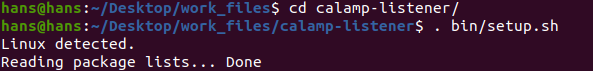
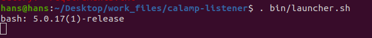
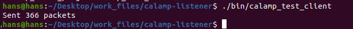
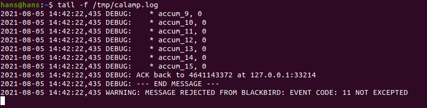

## Redsky Setup

[Overview](#overview) 
[Setup](#setup) 
[Testing](#testing) 

## Overview

Documentation for setting up Project Red Sky, aka the Calamp listener. You should be able to clone this project onto your OS and begin testing the Calamp Listener package. At the end of the setup, there is a testing section you can use for successful verification. 

 

## Setup

- Clone the project into your desired location.
- Run the setup launcher using `. /bin/setup`. The setup script will detect your operating system and pull down the required packages.

<kbd>  </kbd>

- Start the project up with the command `. bin/launcher.sh`. You should get a confirmation message back on your end. 

<kbd>  </kbd>

- Either start a screen session or open another terminal and check the logs with the command `tail -f /tmp/calamp.log`

<kbd>  </kbd>

 

## Testing

You can now test the client by running the command `./bin/calamp_test_client`. You should get a message back saying 366 packets have been sent. 

<kbd>  </kbd>

- Check the `calamp.log` and see your result. 

<kbd>  </kbd>

## Configure `core_config.py`

